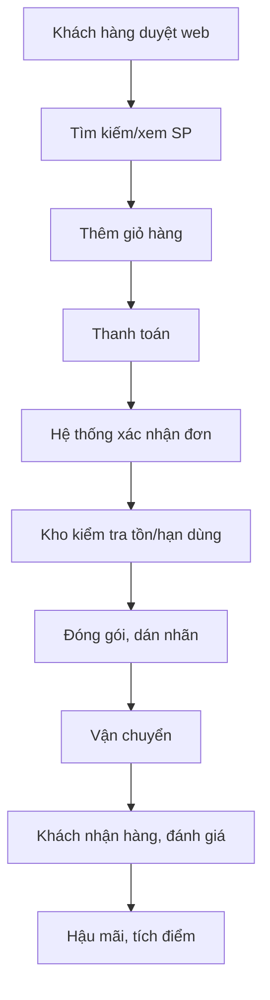
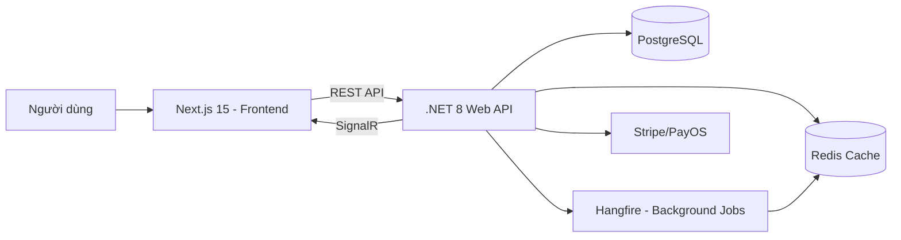

Dưới đây là bản **đặc tả nghiệp vụ và công nghệ hoàn chỉnh** cho dự án **Web bán mỹ phẩm tích hợp hệ thống quản lý nội bộ**. Tài liệu này có thể dùng làm tài liệu thiết kế ban đầu, thuyết trình với khách hàng hoặc làm đầu vào cho đội ngũ phát triển.

---

## 1. GIỚI THIỆU DỰ ÁN

**Tên dự án:** Mỹ phẩm Online – Hệ thống thương mại điện tử & quản lý vận hành

**Mục tiêu:** Xây dựng một nền tảng bán mỹ phẩm trực tuyến chuyên nghiệp, hỗ trợ đầy đủ các nghiệp vụ bán hàng, quản lý kho (đặc thù hạn dùng, lô sản xuất), chăm sóc khách hàng, marketing và báo cáo. Hệ thống phải có khả năng mở rộng, bảo mật cao và trải nghiệm người dùng tốt.

**Đối tượng sử dụng:** Khách hàng mua lẻ, nhân viên bán hàng, nhân viên kho, quản lý, admin.

---

## 2. PHÂN TÍCH NGHIỆP VỤ CHI TIẾT

### 2.1. Phân hệ khách hàng (Website bán hàng)

- **Xem danh mục sản phẩm** theo loại da, công dụng, thương hiệu, thành phần.
- **Tìm kiếm & lọc** sản phẩm (tìm kiếm full-text, lọc theo giá, hạn dùng, chứng nhận).
- **Chi tiết sản phẩm** hiển thị: hình ảnh, INCI, hướng dẫn sử dụng, video, đánh giá, sản phẩm liên quan.
- **Giỏ hàng** – thêm/sửa/xóa, áp dụng mã giảm giá, tính phí ship.
- **Thanh toán** – nhiều phương thức (COD, chuyển khoản, ví điện tử, thẻ tín dụng qua Stripe/PayOS).
- **Quản lý tài khoản** – đăng ký/đăng nhập (JWT), xem lịch sử đơn hàng, quản lý địa chỉ, tích điểm thưởng.
- **Đánh giá sản phẩm** – gắn sao, bình luận kèm ảnh.
- **Theo dõi đơn hàng** – realtime trạng thái (xác nhận, đóng gói, giao hàng, hoàn thành).
- **Nhận thông báo** qua email/SMS (xác nhận đơn, giao hàng, khuyến mãi).

### 2.2. Phân hệ quản trị & vận hành (Admin/Staff)

#### 2.2.1. Quản lý sản phẩm
- Thêm/sửa/xóa sản phẩm, biến thể (dung tích, dạng bào chế).
- Quản lý danh mục, thương hiệu, tags (thành phần, công dụng).
- Upload hình ảnh, video, tài liệu INCI.
- Kiểm duyệt nội dung mô tả (đảm bảo không vi phạm quảng cáo).

#### 2.2.2. Quản lý kho & tồn kho (đặc thù mỹ phẩm)
- Nhập kho theo lô (lot/batch): ghi nhận ngày sản xuất, hạn dùng, số lượng.
- Xuất kho tự động khi có đơn hàng (FEFO – First Expired First Out).
- Cảnh báo tồn kho tối thiểu, hàng sắp hết hạn, hàng đã hết hạn (tự động khóa bán).
- Quản lý hàng mẫu, quà tặng kèm.

#### 2.2.3. Quản lý đơn hàng
- Xem danh sách đơn hàng, lọc theo trạng thái.
- Duyệt đơn (check tồn kho realtime), in phiếu giao hàng.
- Cập nhật trạng thái đơn hàng, gán nhân viên xử lý.
- Xử lý đơn hủy, đổi trả.

#### 2.2.4. Quản lý khách hàng (CRM)
- Xem hồ sơ khách hàng: loại da, tiền sử dị ứng, lịch sử mua hàng.
- Phân hạng thành viên (đồng, bạc, vàng, kim cương) dựa trên chi tiêu.
- Gửi thông báo/email marketing theo phân khúc.

#### 2.2.5. Marketing & khuyến mãi
- Tạo mã giảm giá (theo %/số tiền, áp dụng cho sản phẩm/danh mục/tổng đơn).
- Tạo combo sản phẩm (giá combo thấp hơn mua lẻ).
- Quản lý chương trình tích điểm, đổi thưởng.
- Theo dõi hiệu quả khuyến mãi (báo cáo).

#### 2.2.6. Hậu mãi & đổi trả
- Tiếp nhận yêu cầu đổi/trả, kiểm tra điều kiện (còn seal, trong thời gian cho phép).
- Xử lý hoàn tiền, đổi sản phẩm, gửi voucher an ủi.
- Ghi nhận khiếu nại về dị ứng/kích ứng, đối chiếu lô sản xuất, báo cáo chất lượng.

#### 2.2.7. Báo cáo & thống kê
- Doanh thu theo ngày/tuần/tháng/năm, theo sản phẩm/danh mục.
- Báo cáo tồn kho, hàng sắp hết hạn.
- Báo cáo khách hàng mới, tỷ lệ quay lại.
- Xuất báo cáo dạng Excel/PDF.

### 2.3. Luồng nghiệp vụ chính

---

## 3. YÊU CẦU PHI CHỨC NĂNG

- **Hiệu năng:** Trang web tải trong < 2 giây, hỗ trợ 10.000 người dùng đồng thời.
- **Bảo mật:** Mã hóa dữ liệu nhạy cảm, bảo vệ chống SQL injection, XSS, CSRF. Tuân thủ PCI DSS cho thanh toán.
- **Sẵn sàng:** Hệ thống uptime 99.9%, có cơ chế failover.
- **Khả năng mở rộng:** Thiết kế theo microservices có thể mở rộng sau (nhưng giai đoạn đầu dùng monolithic modular).
- **Bảo trì:** Log tập trung, health check, dễ dàng cập nhật.

---

## 4. KIẾN TRÚC GIẢI PHÁP TỔNG THỂ

Hệ thống được xây dựng theo mô hình **Backend-for-Frontend (BFF)** với 3 tầng chính:

1. **Tầng Presentation:** Next.js 15 (App Router) – SSR/SSG cho SEO, kết hợp client-side tương tác.
2. **Tầng Application (Backend API):** .NET 8 Web API – xử lý nghiệp vụ, cung cấp RESTful API cho Next.js.
3. **Tầng Dữ liệu:** PostgreSQL – lưu trữ chính, Redis – cache phân tán.
4. **Tầng Xử lý nền:** Hangfire + Redis – xử lý tác vụ bất đồng bộ (gửi email, cập nhật tồn kho, tạo báo cáo).

**Sơ đồ kiến trúc:**

---

## 5. CÔNG NGHỆ SỬ DỤNG CHI TIẾT

### 5.1. Backend (.NET 8)

| Thành phần | Công nghệ | Mục đích |
|------------|-----------|----------|
| Framework | .NET 8, ASP.NET Core Web API | Nền tảng chính |
| Kiến trúc | Clean Architecture + CQRS (MediatR) | Tách biệt concerns, dễ bảo trì |
| ORM | Entity Framework Core + Npgsql | Truy vấn PostgreSQL |
| Truy vấn hiệu năng cao | Dapper (kết hợp) | Cho các báo cáo phức tạp |
| Xác thực | JWT, Refresh Token, ASP.NET Core Identity | Quản lý người dùng, phân quyền |
| Caching | StackExchange.Redis + IDistributedCache | Cache dữ liệu tĩnh, session |
| Background jobs | Hangfire (với Redis hoặc PostgreSQL storage) | Gửi email, xử lý ảnh, đồng bộ |
| Realtime | SignalR | Thông báo realtime cho admin/khách |
| Logging | Serilog + Elasticsearch + Kibana (ELK) | Ghi log cấu trúc, tracing |
| Health checks | ASP.NET Core Health Checks | Giám sát trạng thái DB, Redis, API |
| Testing | xUnit, Moq, Testcontainers | Unit test, integration test |
| API Documentation | Swagger/OpenAPI | Tự động tạo tài liệu API |

### 5.2. Frontend (Next.js 15)

| Thành phần | Công nghệ | Mục đích |
|------------|-----------|----------|
| Framework | Next.js 15 (App Router) | SSR/SSG, routing, performance |
| Ngôn ngữ | TypeScript (strict mode) | Type safety |
| State management | Server Components + Server Actions (ưu tiên) + Zustand (client state) | Quản lý state hiệu quả |
| UI Library | Tailwind CSS + Shadcn/ui (hoặc Material-UI) | Giao diện nhanh, responsive |
| HTTP Client | Fetch API (Next.js extensions) + React Query (TanStack Query) | Gọi API, caching, revalidation |
| Authentication | NextAuth.js (Auth.js) với JWT provider | Đăng nhập, session |
| Form handling | React Hook Form + Zod | Validation form, hiệu năng |
| Real-time | @microsoft/signalr (client) | Kết nối SignalR |
| Payment | Stripe.js / PayOS SDK | Thanh toán |
| Testing | Jest, React Testing Library, Playwright | Unit test, E2E |
| Linting/Format | ESLint, Prettier | Code quality |

### 5.3. Database (PostgreSQL)

| Thành phần | Công nghệ | Mục đích |
|------------|-----------|----------|
| Database | PostgreSQL 15+ | Lưu trữ dữ liệu chính |
| Full-text search | Tsvector + Tsquery (PostgreSQL native) | Tìm kiếm sản phẩm |
| JSON support | JSONB columns | Lưu thông số linh hoạt |
| Indexing | B-tree, GIN, Partial indexes | Tối ưu truy vấn |
| Migration | EF Core Migrations + FluentMigrator | Quản lý schema |
| Connection pooling | PgBouncer | Tăng hiệu suất kết nối |

### 5.4. Cache & Message Queue

| Thành phần | Công nghệ | Mục đích |
|------------|-----------|----------|
| Distributed cache | Redis (Docker) | Cache dữ liệu, session, rate limiting |
| Message queue | Redis Streams (hoặc RabbitMQ nếu cần) | Hàng đợi cho background jobs |

### 5.5. DevOps & Triển khai

| Thành phần | Công nghệ | Mục đích |
|------------|-----------|----------|
| Containerization | Docker, Docker Compose | Môi trường đồng nhất |
| Orchestration | Kubernetes (nếu scale lớn) hoặc Docker Swarm | Quản lý container |
| CI/CD | GitHub Actions / GitLab CI | Tự động build, test, deploy |
| Hosting - Backend | Azure App Service / AWS ECS | Cloud |
| Hosting - Frontend | Vercel (tối ưu cho Next.js) | CDN, auto SSL |
| Hosting - Database | AWS RDS / Azure Database for PostgreSQL | Managed database |
| Hosting - Redis | Redis Cloud / Upstash | Managed Redis |
| Monitoring | Prometheus + Grafana (metrics), ELK (logs) | Giám sát toàn diện |

---

## 6. TÍCH HỢP VÀ LUỒNG DỮ LIỆU

### 6.1. Tích hợp giữa Next.js và .NET API

- Next.js gọi API thông qua **Server Components** (fetch trực tiếp ở server) hoặc **Server Actions** (cho mutation).
- Sử dụng **Next.js Middleware** để kiểm tra token JWT trước khi gửi request đến API.
- API trả về JSON, Next.js render thành HTML.

### 6.2. Xác thực luồng

1. Người dùng đăng nhập qua form → Server Action gọi endpoint `/api/auth/login` của .NET.
2. .NET xác thực, trả về Access Token (ngắn hạn) và Refresh Token (dài hạn, lưu trong httpOnly cookie).
3. Next.js lưu Access Token trong memory (hoặc cookie) và gửi kèm trong các request tiếp theo qua header `Authorization: Bearer ...`.
4. Khi Access Token hết hạn, Next.js gọi `/api/auth/refresh` để lấy token mới.

### 6.3. Realtime với SignalR

- .NET API chạy SignalR Hub.
- Next.js client kết nối WebSocket tới Hub.
- Khi đơn hàng thay đổi trạng thái (admin cập nhật), Hub gửi thông báo tới client cụ thể.

### 6.4. Xử lý background jobs

- Khi khách đặt hàng, API tạo một job Hangfire: gửi email xác nhận, kiểm tra tồn kho bất đồng bộ, ghi log.
- Job chạy nền không làm chậm response trả về cho khách hàng.

---

## 7. TRIỂN KHAI & KẾ HOẠCH PHÁT TRIỂN

### Giai đoạn 1 (MVP - 2 tháng)
- Xây dựng backend API cơ bản: quản lý sản phẩm, đơn hàng, kho.
- Frontend: trang chủ, danh sách sản phẩm, chi tiết, giỏ hàng, thanh toán (COD + chuyển khoản).
- Quản trị: quản lý sản phẩm, đơn hàng cơ bản.

### Giai đoạn 2 (Mở rộng - 1.5 tháng)
- Tích hợp Redis caching, tối ưu hiệu năng.
- Thêm chức năng: đánh giá sản phẩm, tích điểm, khuyến mãi (mã giảm giá).
- Báo cáo thống kê cơ bản.

### Giai đoạn 3 (Hoàn thiện - 1 tháng)
- Tích hợp SignalR realtime, thanh toán qua thẻ (Stripe/PayOS).
- Xây dựng hệ thống log tập trung (ELK), health checks.
- Deploy lên production, cấu hình CI/CD.

---

## 8. KẾT LUẬN

Bản nghiệp vụ và công nghệ trên cung cấp một lộ trình rõ ràng để xây dựng hệ thống bán mỹ phẩm trực tuyến hiện đại, đáp ứng đặc thù ngành (quản lý hạn dùng, lô sản xuất, tư vấn da). Việc lựa chọn **.NET 8 + Next.js 15 + PostgreSQL** đảm bảo hiệu năng, bảo mật và khả năng mở rộng. Với kiến trúc phân tầng và các công nghệ hỗ trợ như Redis, Hangfire, SignalR, hệ thống sẽ vận hành ổn định và dễ dàng bảo trì lâu dài.

---

*Tài liệu được soạn thảo bởi Lê Nam. Mọi thắc mắc xin liên hệ: …*